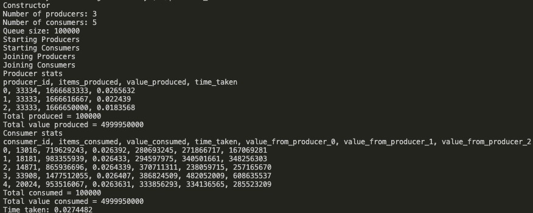

# Multithreaded Producer/Consumer

This is a personal C++ project implementing a program to solve the multi-producer/multi-consumer problem. `pthread`, `mutex`, `conditional variable` are employed.

## Producer-Consumer Problem

In this problem, we want to create `p` producer threads that produce `n` items in total, and `q` consumer threads consuming those items. Each producer thread produces n/p items (integer division). Any remaining items will be produces by producer thread 0. <br>

- A producer produces items marked with two values: the ID of the producer and a value that is determined according to the producer's id and the total number of the producers. For instance, if there are 3 producers, producer 0 will create its items in this way: (0, 0),(0, 3),(0, 6), etc.<br>
- A consumer consumes items and records the corresponding information.<br>
- Time taken by each thread will be recorded.
- A stat will be printed as the result that can be used for verifying.<br>

## How to run

Clone this repo and enter the directory. Then type in your shell:<br>
Compile:

```
$ make producer_consumer
```

Test the binary like this:

```
$ ./producer_consumer --nItems 100000 --nProducers 3 --nConsumers 5 --bufferSize 100000
```

Then the stat would be printed like this:



